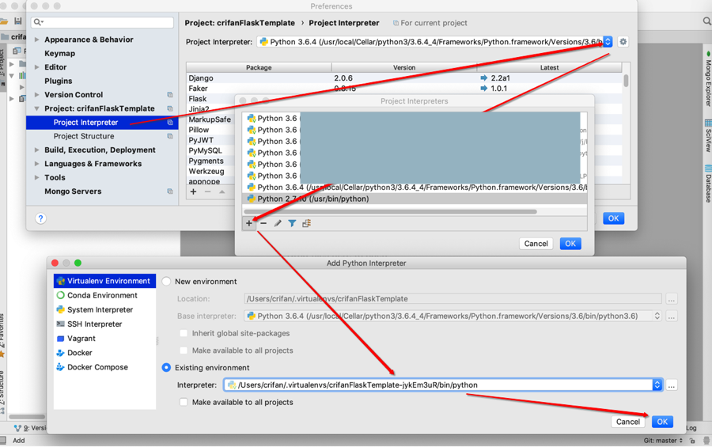
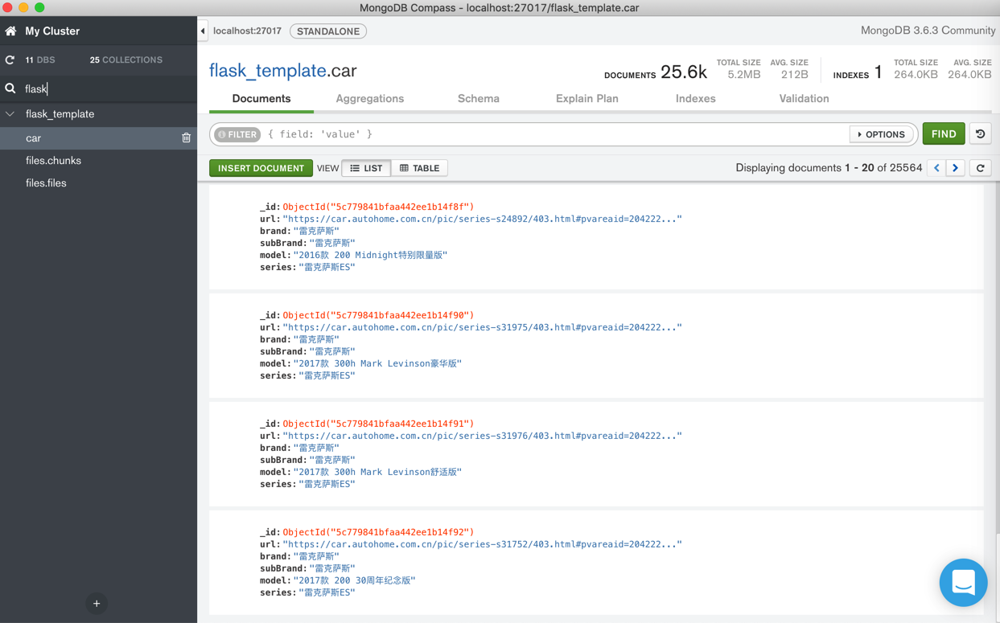
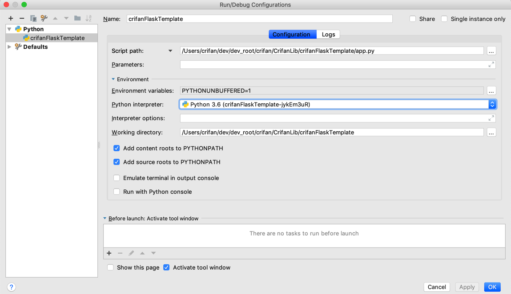
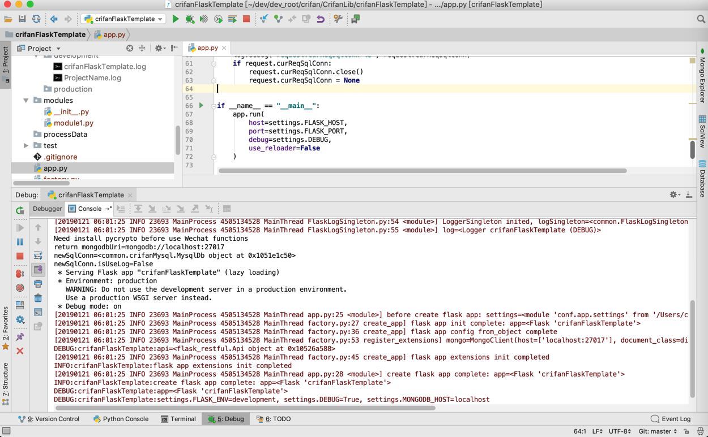
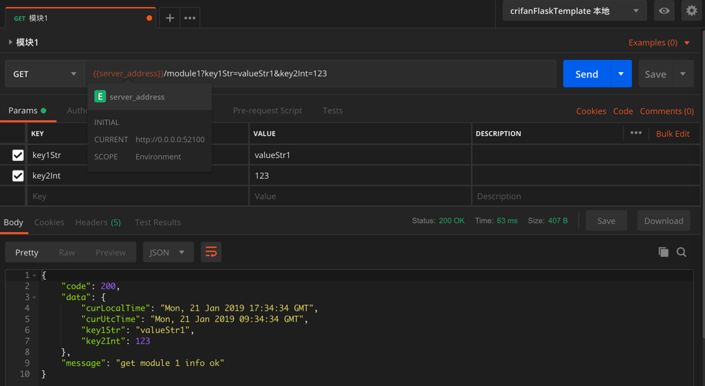

# crifanFlaskTemplate

最后更新：`20190228`

基于`Python 3`的Crifan's Flask项目模版，用于快速开始Flask项目开发

目前主要是自己用，希望对别人也有用

## TODO

## 功能特点

* 结构化
* 默认安装常用模块
  * `flask-restful`：实现 [REST](http://book.crifan.com/books/http_restful_api/website/) API
  * `redis` + `flask-redis`：用于缓存/临时存储数据
    * 使用场景举例：`set`保存验证码，用`expire`支持自动过期
  * `flask-pymongo`: `MongoDB`数据库
  * `gunicorn`：服务器端部署
  * `flask-cors`：支持 [CORS](http://book.crifan.com/books/cors_dev_ummary/website/)
  * `python-dotenv`：用于管理多套配置参数
  * `gevent` + `greenlet`：部署支持异步，提升性能
  * `pymysql`：[MySQL](http://book.crifan.com/books/popular_rmdb_mysql/website/) 数据库
  * `requests`：请求网络
  * `pillow`：图片处理，比如压缩图片质量
* 支持静态文件
  * 举例: 可以直接打开放在`assets/images`下面的图片文件：`http://127.0.0.1:52100/assets/images/crifan.com_logo.png`
* 支持`MongoDB`的常见功能：
  * 对于`Gridfs`文件
    * `上传`
    * `下载`
  * 对于普通`collection`
    * 获取单个`record`的`json`详情
    * 获取分页数据

## 代码仓库

crifan/crifanFlaskTemplate: crifanLib python flask template

https://github.com/crifan/crifanFlaskTemplate

## 项目结构

```shell
.
├── Pipfile                     # pipenv的文件，指定依赖了，需要安装哪些库
├── README.md                   # 此文件，项目说明文件
├── app.py                      # Flask的入口`app`
├── assets                      # 保存静态资源文件
│   └── images
│       ├── crifan.com_logo.png
│       ├── postman_test_flask_api.png
│       ├── pycharm_debug_configuration.png
│       └── pycharm_set_pipenv_virtual_python.png
├── common                      # 通用的内容，
│   ├── FlaskLogSingleton.py    # log日志的单例
│   ├── ThreadSafeSingleton.py  # 单线程的单例
│   ├── __init__.py
│   ├── crifanMysql.py          # 封装了mysql操作
│   └── util.py # 常见的一些功能函数，主要拷贝自 https://github.com/crifan/crifanLibPython/tree/master/crifanLib
├── conf                        # 所有配置相关内容
│   ├── __init__.py
│   ├── app                     # 和Flask的app相关的配置
│   │   ├── __init__.py
│   │   ├── development         # dev=local本地开发相关配置
│   │   │   └── __init__.py
│   │   ├── production          # prod=生产环境=线上环境相关配置
│   │   │   └── __init__.py
│   │   └── settings.py         # 根据dev和prod解析生成的最终的配置
│   ├── gunicorn                # 部署相关：进程管理？
│   │   └── gunicorn_config.py  # 本地和在线的进程管理
│   └── supervisor              # 部署相关：任务管理
│       ├── supervisord_crifanFlaskTemplate.conf  # 在线环境的supervisord配置
│       └── supervisord_local.conf                # 本地环境的supervisord配置
├── deploy
│   └── fabfile.py              # 用于部署代码到在线服务器
├── factory.py                  # Flask的app的各种功能和模块的工厂初始化
├── logs
│   ├── development             # 保存本地开发的log日志文件
│   │   └── crifanFlaskTemplate.log
│   └── production              # 保存生产环境log日志文件
├── modules                     # 保存业务逻辑相关的各种模块
│   ├── __init__.py
│   └── user.py                 # 演示`mysql`如何使用的用户模块
│   └── car.py                  # 演示MongoDB如何使用的`flask_template.car`模块
├── processData                 # 项目相关的数据处理相关脚本
│   └── fileToMongo
│       └── saveFileToMongodb.py # 把`assets`目录下的本地文件都保存到mongodb中，用于演示MongoDB相关api
│   └── saveCarToMongo
│       └── saveCarToMongodb.py # 把`assets/car/汽车之家品牌车系车型数据-25564条 180429 utf8.csv`中的2万多条汽车数据保存到MongoDB的`flask_template.car`中
└── test                        # 测试相关
    └── locust
        └── locustfile.py       # locust性能测试脚本
```

## 项目初始化

### 安装库

* 去终端中安装库：`pipenv install`
* `可选` 确认已安装成功：
  * 看看安装了哪些库以及相关的依赖：`pipenv graph`
  * 进入虚拟环境：`pipenv shell`
  * 看看当前python解释器：`which python`

> `mime`库兼容性有问题，会导致直接运行`processData/fileToMongo/saveFileToMongodb.py`会报错：
> `UnicodeDecodeError ascii codec can't decode byte 0xb4 in position 295 ordinal not in range 128`
> 解决办法：修改文件
> `/Users/crifan/.virtualenvs/crifanFlaskTemplate-jykEm3uR/lib/python3.6/site-packages/mime/mime_types.py`
> 为：
```python
    def load_from_file(cls, type_file):
        # data = open(type_file).read()
        data = open(type_file, encoding="utf-8").read()
```

### PyCharm中设置python解释器

新建PyCharm项目，去设置python解释器：

`PyCharm` -> `Preferences` -> `Project: crifanFlaskTemplate` -> `Project Intepreter` -> `Show All` -> `Add` -> `crifanFlaskTemplate-jykEm3uR`



> 注意：其中如果找不到相关虚拟环境，则删除`.idea/`目录后再重建PyCharm项目，即可找到。

### 数据库：Mysql

使用本地`user`模块之前，先要去建对应的`mysql`的表`user：`

```mysql
CREATE TABLE `user` (
  `id` int(11) unsigned NOT NULL AUTO_INCREMENT,
  `name` varchar(50) DEFAULT '',
  `phone` varchar(20) DEFAULT NULL,
  `createdTime` datetime DEFAULT NULL,
  `updatedTime` datetime DEFAULT NULL,
  `lastActiveTime` datetime DEFAULT NULL,
  PRIMARY KEY (`id`),
  UNIQUE KEY `phone_UNIQUE` (`phone`)
) ENGINE=InnoDB DEFAULT CHARSET=utf8mb4;
```

这样才能通过`user`接口，去 新建用户，获取用户信息，更新用户信息等操作。

### 数据库：`MongoDB`

#### 导入本地资源文件

运行：

```shell
pipenv shell
python processData/fileToMongo/saveFileToMongodb.py
```

即可把`assets/images`和`assets/audios`中的文件，都导入到`MongoDB`的`gridfs`即`flask_template.files`中去了，可供后续演示如何使用`MongoDB`。

#### 导入模拟数据：Car汽车信息

运行：

```shell
pipenv shell
python processData/saveCarToMongo/saveCarToMongodb.py
```

即可把`assets/car/汽车之家品牌车系车型数据-25564条 180429 utf8.csv`中的2万多条汽车数据导入到`flask_template.car`中：



## 项目开发和调试

### 如何调试

第一次，需要新增`Debug`的配置：

`PyCharm` -> `Run` -> `Edit Configurations` -> `Add` -> `Python`：

* `Name`: 你的项目名，比如`crifanFlaskTemplate`
* `Script Path`: `/Users/crifan/dev/dev_root/crifan/CrifanLib/crifanFlaskTemplate/app.py`
* `Python Interpreter`: `Python Default(Python 3.6(crifanFlaskTemplate-jykEm3uR))`
* `Working Directory`: `/Users/crifan/dev/dev_root/crifan/CrifanLib/crifanFlaskTemplate`



然后即可去`Run` -> `Debug`去启动调试了：



想要中断调试，可以用快捷键：Mac是`Command+F2`，Win是`Control+F2`

### 接口测试

#### Postman

测试Flask的API接口的工具很多，此处推荐：[Postman](https://book.crifan.com/books/api_tool_postman/website/)

截图示例：



Postman的配置：

为了方便用`Postman`调试，已导出自己的`Postman`配置，放在：`assets/postman/crifanFlaskTemplate.postman_collection_20190228.json`，去`Postman -> File -> Import`即可导入，即可直接用来开发测试Flask的api接口。

## 项目部署

通过`gunicorn`和`supervisor`去部署。

### 首次部署

#### 部署代码

SSH登录`production_server_ip`

```bash
cd /Project/Root/Path/
git clone https://github.com/crifan/crifanFlaskTemplate.git
cd crifanFlaskTemplate
pipenv shell
```

#### 配置`supervisord`

上传: `conf/supervisor/supervisord_crifanFlaskTemplate.conf` 到 `cd /etc/supervisord.d/`

启动：

```bash
supervisorctl reload
supervisorctl start crifanFlaskTemplate
supervisorctl status crifanFlaskTemplate
```

#### [可选]阿里云安全组开通端口

如果用的服务器是阿里云的，注意需要开通相关端口：

进入阿里云管理控制台，去添加配置：

* 协议类型：`自定义TCP`
* 端口范围：`52100/52100`
* 优先级: `1`
* 授权类型：`IPv4地址段访问`
* 授权对象: `0.0.0.0/0`
* 描述：`允许外部访问crifanFlaskTemplate`

### 更新代码后部署最新代码

下载最新代码：

```bash
cd /Project/Root/Path/
git pull
```

如果改动了`Pipfile`，有安装新库，记得要：

```bash
pipenv install
```

重启服务：

```bash
supervisorctl restart crifanFlaskTemplate
supervisorctl status crifanFlaskTemplate
```

## API文档

### 通用解释

通用介绍：

* url前缀
    * 本地测试：`http://0.0.0.0:52100`
    * 在线接口-IP形式：`http://production_server_ip:52100`
    * 在线接口-域名形式：`https://production.server_domain.com/url_mapping_in_nginx`

举例：

* `http://0.0.0.0:52100/user?id=2`
* `http://12.34.56.78:52100/user?id=2`

### 用户

#### 新建用户

* Request
  * Method: `POST`
  * Headers:
    * `Content-Type`: `application/json`
  * URL: `/user`
  * Parameter
  * Body
    * `name`：str，用户名
    * `phone`：str，用户手机号
```json
{
	"name": "crifan",
	"phone": "13800001111"
}
```
* Response
  * Body
    * data
```json
{
    "code": 200,
    "data": {
        "createdTime": "Tue, 22 Jan 2019 03:20:51 GMT",
        "id": 2,
        "lastActiveTime": "Tue, 22 Jan 2019 03:20:51 GMT",
        "name": "crifan",
        "phone": "13800001111",
        "updatedTime": "Tue, 22 Jan 2019 03:20:51 GMT"
    },
    "message": "Create user ok"
}
```

#### 获取用户信息

* Request
  * Method: `GET`
  * URL: `/user?id={userId}`
    * eg: `/user?id=2`
  * Parameter
    * `id`：int，用户ID
* Response
  * Body
    * data
```json
{
    "code": 200,
    "data": {
        "createdTime": "Tue, 22 Jan 2019 03:20:51 GMT",
        "id": 2,
        "lastActiveTime": "Tue, 22 Jan 2019 03:20:51 GMT",
        "name": "crifan",
        "phone": "13800001111",
        "updatedTime": "Tue, 22 Jan 2019 03:20:51 GMT"
    },
    "message": "Get user ok"
}
```

#### 更新用户信息

* Request
  * Method: `PUT`
  * Headers:
    * `Content-Type`: `application/json`
  * URL: `/user`
  * Parameter
    * `id`：int，用户ID
    * 其他要更新的字段
```json
{
	"id": 2,
	"phone": "13811112222"
}
```
* Response
  * Body
    * data
```json
{
    "code": 200,
    "data": {
        "createdTime": "Tue, 22 Jan 2019 03:20:51 GMT",
        "id": 2,
        "lastActiveTime": "Tue, 22 Jan 2019 03:54:45 GMT",
        "name": "crifan",
        "phone": "13811112222",
        "updatedTime": "Tue, 22 Jan 2019 03:54:45 GMT"
    },
    "message": "Update user ok"
}
```

### Car汽车

#### 获取Car信息

* Request
  * Method: `GET`
  * URL: `/car?id={carId}`
    * eg: `/car?id=5c779841bfaa442ee1b14f90`
  * Parameter
    * `id`：str，Car的Mongodb的id
* Response
  * Body
    * data
```json
{
    "code": 200,
    "data": {
        "_id": "5c779841bfaa442ee1b14f90",
        "brand": "雷克萨斯",
        "model": "2017款 300h Mark Levinson豪华版",
        "series": "雷克萨斯ES",
        "subBrand": "雷克萨斯",
        "url": "https://car.autohome.com.cn/pic/series-s31975/403.html#pvareaid=2042220"
    },
    "message": "Get car ok"
}
```

#### 获取Car列表

* Request
  * Method: `GET`
  * URL: `/car`
    * Parameter
      * `pageNumber`：int，页码
      * `pageSize`：int，每一页的个数
      * `searchText`：str，要查找的值
        * 内部从如下字段去搜索：
          * `url`
          * `brand`
          * `subBrand`
          * `model`
          * `series`
    * eg: 
      * `/car?pageNumber=1&pageSize=10&searchText=Jeep`
* Response
  * Body
    * data
```json
[{
    "code": 200,
    "data": {
        "_id": "5c779841bfaa442ee1b14f90",
        "brand": "雷克萨斯",
        "model": "2017款 300h Mark Levinson豪华版",
        "series": "雷克萨斯ES",
        "subBrand": "雷克萨斯",
        "url": "https://car.autohome.com.cn/pic/series-s31975/403.html#pvareaid=2042220"
    },
    "message": "Get car ok"
}]({
    "code": 200,
    "data": {
        "carList": [
            {
                "_id": "5c77984dbfaa442ee1b16158",
                "brand": "Jeep",
                "model": "2011款 Mojave",
                "series": "牧马人",
                "subBrand": "Jeep(进口)",
                "url": "https://car.autohome.com.cn/pic/series-s10006/121.html#pvareaid=2042220"
            },
            {
                "_id": "5c77984dbfaa442ee1b1619a",
                "brand": "Jeep",
                "model": "2011款 3.0L CRD",
                "series": "大切诺基(进口)",
                "subBrand": "Jeep(进口)",
                "url": "https://car.autohome.com.cn/pic/series-s10062/521.html#pvareaid=2042220"
            },
            {
                "_id": "5c77984dbfaa442ee1b16157",
                "brand": "Jeep",
                "model": "2011款 2.8L CRD",
                "series": "牧马人",
                "subBrand": "Jeep(进口)",
                "url": "https://car.autohome.com.cn/pic/series-s10064/121.html#pvareaid=2042220"
            },
            {
                "_id": "5c77984dbfaa442ee1b161da",
                "brand": "Jeep",
                "model": "2011款 2.4L 四驱70周年限量版",
                "series": "指南者(进口)",
                "subBrand": "Jeep(进口)",
                "url": "https://car.autohome.com.cn/pic/series-s10154/504.html#pvareaid=2042220"
            },
            {
                "_id": "5c77984dbfaa442ee1b161dd",
                "brand": "Jeep",
                "model": "2011款 2.4L 四驱运动版",
                "series": "指南者(进口)",
                "subBrand": "Jeep(进口)",
                "url": "https://car.autohome.com.cn/pic/series-s10272/504.html#pvareaid=2042220"
            },
            {
                "_id": "5c77984dbfaa442ee1b161db",
                "brand": "Jeep",
                "model": "2011款 2.4L 四驱豪华导航版",
                "series": "指南者(进口)",
                "subBrand": "Jeep(进口)",
                "url": "https://car.autohome.com.cn/pic/series-s10274/504.html#pvareaid=2042220"
            },
            {
                "_id": "5c77984dbfaa442ee1b16217",
                "brand": "Jeep",
                "model": "2011款 2.4 运动版",
                "series": "自由客",
                "subBrand": "Jeep(进口)",
                "url": "https://car.autohome.com.cn/pic/series-s10278/777.html#pvareaid=2042220"
            },
            {
                "_id": "5c77984dbfaa442ee1b16219",
                "brand": "Jeep",
                "model": "2011款 2.4 经典版",
                "series": "自由客",
                "subBrand": "Jeep(进口)",
                "url": "https://car.autohome.com.cn/pic/series-s10279/777.html#pvareaid=2042220"
            },
            {
                "_id": "5c77984dbfaa442ee1b1619b",
                "brand": "Jeep",
                "model": "2011款 UK Version",
                "series": "大切诺基(进口)",
                "subBrand": "Jeep(进口)",
                "url": "https://car.autohome.com.cn/pic/series-s10385/521.html#pvareaid=2042220"
            },
            {
                "_id": "5c77984dbfaa442ee1b16218",
                "brand": "Jeep",
                "model": "2011款 2.4 经典升级版",
                "series": "自由客",
                "subBrand": "Jeep(进口)",
                "url": "https://car.autohome.com.cn/pic/series-s10541/777.html#pvareaid=2042220"
            }
        ],
        "curPageNum": 1,
        "hasNext": true,
        "hasPrev": false,
        "numPerPage": 10,
        "totalNum": 335,
        "totalPageNum": 34
    },
    "message": "Get car ok"
})
```

### MongoDB的Gridfs文件

#### 下载文件

* Request
  * Method: `GET`
  * URL: `/file/flask_template/files/{fileId}/[filename]`
    * Parameter
      * `fileId`：gridfs中file的id，必填
      * [`filename`]：gridfs中file的filename，选填
    * eg：
      * 某图片：
        * gridfs id: 5c47fdb2bfaa4495e591718a
        * filename: crifan.com_logo.png
        * ->
        * `http://0.0.0.0:52100/file/flask_template/files/5c47fdb2bfaa4495e591718a/crifan.com_logo.png`
      * 某音频文件：
        * gridfs id: 5c47fdb2bfaa4495e5917184
        * filename: Sadness - Enigma part - 1.mp3
        * ->
        * `http://0.0.0.0:52100/file/flask_template/files/5c47fdb2bfaa4495e5917184/Sadness%20-%20Enigma%20part%20-%201.mp3`

* Response
  * 可下载的文件
    * 可通过浏览器或Postman去测试下载文件

#### 上传文件

* Request
  * Method: `POST`
  * URL: `/file/flask_template/files`
  * Headers:
    * `filename`: `{yourFileName}`
      * `yourFileName`：上传的文件的文件名
        * eg: `Snip20190228_14.png`
  * Body
    * `postman`测试时，选择的是`binary`类型，再通过弹框选择某个文件即可
* Response
  * Body
    * data
```json
{
    "code": 200,
    "message": "Create new gridfs file ok",
    "data": {
        "_id": "5c77ac60bfaa44375a908eff",
        "filename": "Snip20190228_14.png",
        "contentType": "image/png",
        "length": 322599,
        "uploadDate": "2019-02-28 09:39:44.616000",
        "md5": "e58ddc6367ee2bf340135d7727ef8b20"
    }
}
```

提示：

此文件即可通过url访问：

`http://0.0.0.0:52100/file/flask_template/files/5c77ac60bfaa44375a908eff/Snip20190228_14.png`
